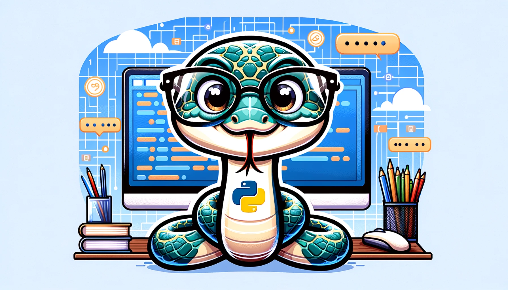

# Python Masterclass 2024

## Temas Abordados

1. **Fundamentos**: introdução dos conceitos basilares da linguagem Python
2. **Dados**: apresentação das estruturas de dados mais importantes da linguagem
3. **Controle**: estruturas de controle: condicionais e repetições
4. **Função**: fundamentação básica do sobre funções em Python
5. **Extras**: exemplo de parser JSON
6. **Final**: integração com ChatGPT para gerar perguntas sobre programação

